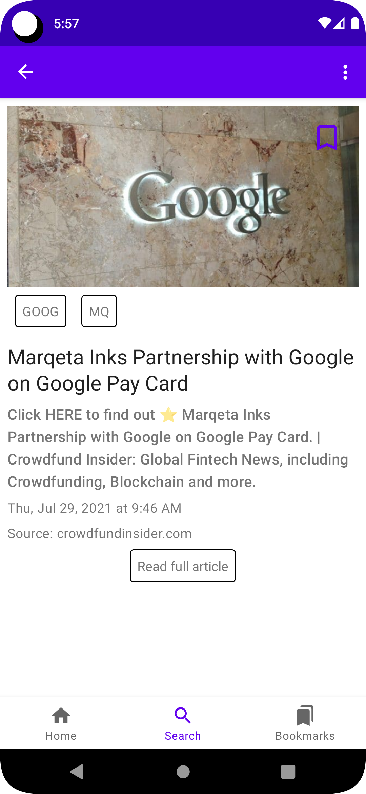

Zeke Market News
=================

Zeke Market News is the ultimate financial news app, designed to help you stay up-to-date on the latest market happenings. With Zeke Market News, you can view, search, and bookmark the latest financial news, with each article featuring clickable tickers that allow you to see the current price and graphical data in a Candlestick chart. You can customize the chart to view data in a variety of date ranges, including 1 day, 5 days, 1 month, year-to-date, and 1 year. Plus, the app looks great in Dark mode too!

Built with Kotlin, Android Jetpack and MVVM architecture, Zeke Market News makes calls to the StockData API for latest financial news and the Finnhub API for ticker price and candlestick data such open, high, low, close and volume(OHLCV) for stocks.

Features:
--------------
* Dark Mode
* Pagination of searched articles
* Facebook Shimmer Loading Animation 
* Candlestick Chart with clickable OHLCV data

Libraries Used
--------------
* View Binding
* Lifecycles
* LiveData
* Navigation Component
* Room
* ViewModel
* Fragment
* Dagger Hilt - Dependency Injection
* Kotlin Coroutines
* Material Design
* Swipe Refresh Layout
* Facebook Shimmer
* Gson
* Moshi
* Retrofit
* Glide
* Paging 3
* MPAndroidChart

Screenshots
-----------

  
  
  

  
  
  

  
  

